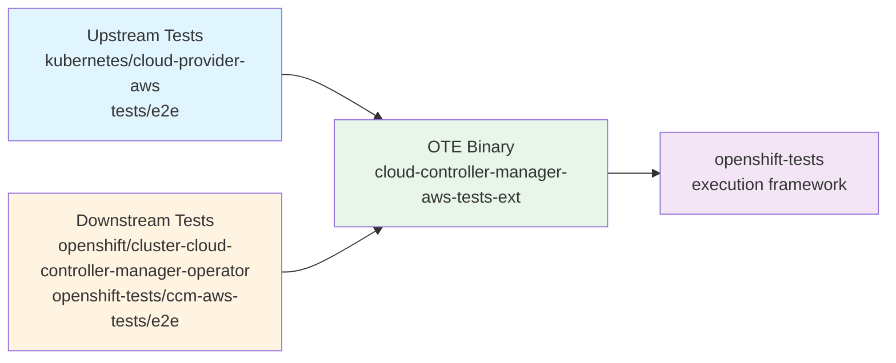

# OpenShift Tests Extension (OTE) for AWS Cloud Controller Manager

The OpenShift Tests Extension (OTE) binary `cloud-controller-manager-aws-tests-ext`
exposes the upstream e2e tests from `cloud-provider-aws` (implemented under `tests/e2e`)
to the OpenShift test framework. Tests are selected/curated by the filters defined in
`main.go`, so that only the intended subset is available in the OpenShift test pipeline.

OpenShift-specific (downstream) tests live under `openshift-tests/ccm-aws-tests/e2e/aws`
and are added to the list of tests executed by `openshift-tests`.

The OTE library uses dot imports to register both upstream and downstream Ginkgo specs into the suite.



## Directory Structure

```text
openshift-tests/ccm-aws-tests/
├── e2e/
│   ├── aws/
│   │   ├── loadbalancer.go    # OpenShift-specific load balancer tests
│   │   └── helper.go          # AWS client helpers (ELBv2, EC2, LB lookup)
│   └── common/
│       └── helper.go          # Shared helpers (feature gate, topology detection)
├── main.go                    # Test binary entrypoint
├── go.mod
└── vendor/
```

## Prerequisites

- Go 1.24+
- Access to an OpenShift cluster on AWS
- Valid `KUBECONFIG` pointing to the cluster
- AWS credentials configured (for tests that query AWS APIs):
  `AWS_REGION`, `AWS_SHARED_CREDENTIALS_FILE`, or default SDK credential chain

## Building

### Building the test binary

From the root of the project:

```sh
make cloud-controller-manager-aws-tests-ext
```

The binary will be at `openshift-tests/bin/cloud-controller-manager-aws-tests-ext`.

### Building the container image

```sh
podman build --authfile $PULL_SECRET_FILE -f Dockerfile.openshift -t ccm-local:devel .
# OR
make image
```

The binary is embedded in the image at `/usr/bin/cloud-controller-manager-aws-tests-ext.gz`.

## Using the test binary

### List available tests

```sh
./openshift-tests/bin/cloud-controller-manager-aws-tests-ext list tests | jq .[].name
```

### List test suites

```sh
./openshift-tests/bin/cloud-controller-manager-aws-tests-ext list suites | jq .[].name
```

### Run a specific test (standalone cluster)

```sh
export KUBECONFIG=/path/to/kubeconfig
export AWS_REGION=us-east-1

./openshift-tests/bin/cloud-controller-manager-aws-tests-ext run-test \
  "[cloud-provider-aws-e2e] loadbalancer CLB should be reachable with default configurations [Suite:openshift/conformance/parallel]"
```

### Run multiple tests by pattern

The `run-test` command only supports running **one test at a time** (a known
OTE framework limitation). To batch-run tests matching a
pattern, use process substitution so that each invocation gets its own stdin:

```sh
BIN=./openshift-tests/bin/cloud-controller-manager-aws-tests-ext

# Run all AWSServiceLBNetworkSecurityGroup tests
while IFS= read -r t; do
  echo "=== Running: $t"; $BIN run-test "$t" < /dev/null
done < <($BIN list tests | jq -r '.[].name' | grep "AWSServiceLBNetworkSecurityGroup")

# Run all upstream loadbalancer tests
while IFS= read -r t; do
  echo "=== Running: $t"; $BIN run-test "$t" < /dev/null
done < <($BIN list tests | jq -r '.[].name' | grep "\[cloud-provider-aws-e2e\] loadbalancer")

# Run all tests (upstream + downstream)
while IFS= read -r t; do
  echo "=== Running: $t"; $BIN run-test "$t" < /dev/null
done < <($BIN list tests | jq -r '.[].name')
```

> **Note:** The `< /dev/null` is required — `run-test` reads stdin for
> additional test names, and without it the first invocation would consume
> all remaining names from the loop's input.

Results may be quite verbose, you can pipe the logs to file and query results later with a summary:

```sh
run_test(){
    while IFS= read -r t; do
    echo "=== Running: $t";
    $BIN run-test "$t" < /dev/null;
done < <($BIN list tests | jq -r '.[].name' | grep "AWSServiceLBNetworkSecurityGroup"); }

run_test | tee -a e2e-ote.log

grep -E "(name\"\:|\"result\")" e2e-ote.log
```

### Run a specific test (HyperShift hosted cluster)

When running against a HyperShift hosted cluster, `KUBECONFIG` must point to the
**guest** (hosted) cluster. Additionally, the AWSServiceLBNetworkSecurityGroup
tests need access to the management cluster to validate the CCM cloud-config,
which lives in the hosted control plane namespace.

Set these environment variables before running:

```sh
# Guest cluster kubeconfig (where tests run)
export KUBECONFIG=/path/to/hosted-cluster/kubeconfig

# Management cluster kubeconfig (for cloud-config validation)
export HYPERSHIFT_MANAGEMENT_CLUSTER_KUBECONFIG=/path/to/management-cluster/kubeconfig

# HCP namespace on the management cluster (e.g., clusters-<cluster-name>)
export HYPERSHIFT_MANAGEMENT_CLUSTER_NAMESPACE=clusters-my-hosted-cluster

# AWS credentials for the account where the hosted cluster's resources live.
# These must have permissions for DescribeLoadBalancers (ELBv2) and
# DescribeSecurityGroups (EC2). In CI, this is the hypershift pool account.
export AWS_SHARED_CREDENTIALS_FILE=/path/to/aws/credentials
export AWS_REGION=us-east-1
```

Then run the test:

```sh
./openshift-tests/bin/cloud-controller-manager-aws-tests-ext run-test \
  "[cloud-provider-aws-e2e-openshift] loadbalancer NLB [OCPFeatureGate:AWSServiceLBNetworkSecurityGroup] should have NLBSecurityGroupMode with 'Managed value in cloud-config [Suite:openshift/conformance/parallel]"
```

The test automatically detects External topology (HyperShift) by querying the
cluster's `Infrastructure` resource and reads the cloud-config from ConfigMap
`aws-cloud-config` in the HCP namespace on the management cluster, instead of
`cloud-conf` in `openshift-cloud-controller-manager` on the guest cluster.


#### Skipping tests that require management cluster access

If you are running against a HyperShift hosted cluster but do **not** have
access to the management cluster kubeconfig, you can skip those tests by setting:

```sh
export SKIP_MANAGEMENT_CLUSTER_TESTS=true
```

This will skip any test that requires reading resources from the management
cluster (e.g., the cloud-config validation test). All other tests will run
normally.

## CI Jobs

### Self managed

Any job using `openshift/conformance/parallel` suite on OpenShift self-managed on AWS must run tests provided by CCM-AWS OTE, unless explicitly skipped (See [OTE setup](https://github.com/openshift/cluster-cloud-controller-manager-operator/tree/main/openshift-tests/ccm-aws-tests) for more information).

### HyperShift (Hosted Cluster)

The periodic CI job that runs these tests on Hosted Cluster is:

```text
periodic-ci-openshift-hypershift-release-5.0-e2e-aws-ovn-conformance-ccm-techpreview
```

The CI step (`hypershift-conformance`) automatically sets the management cluster
environment variables (`HYPERSHIFT_MANAGEMENT_CLUSTER_KUBECONFIG`,
`HYPERSHIFT_MANAGEMENT_CLUSTER_NAMESPACE`) before launching `openshift-tests`.
