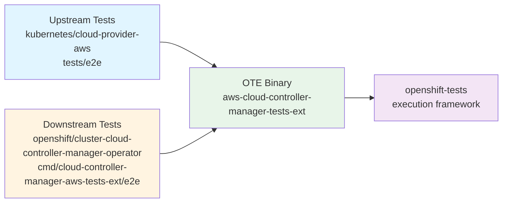

# OpenShift Tests Extension (OTE) for AWS Cloud Controller Manager

The OpenShift Tests Extension (OTE) binary `aws-cloud-controller-manager-tests-ext`
exposes the upstream e2e tests from `cloud-provider-aws` (implemented under `tests/e2e`)
to the OpenShift test framework. Tests are selected/curated by the filters defined in
`main.go`, so that only the intended subset is available in the OpenShift test pipeline.

OpenShift-specific (downstream) tests live under `cmd/cloud-controller-manager-aws-tests-ext/e2e`
and are added to the list of tests executed by `openshift-tests`.

The OTE library uses dot imports to register both upstream and downstream Ginkgo specs into the suite.



## Directory Structure

```
cmd/cloud-controller-manager-aws-tests-ext/
├── e2e/
│   ├── loadbalancer.go    # OpenShift-specific load balancer tests
│   └── helper.go           # Helper functions (AWS clients, feature gate checks, etc.)
├── main.go                 # Test binary entrypoint
└── README.md
```

## Prerequisites

- Go 1.24+
- Access to an OpenShift cluster on AWS
- Valid `KUBECONFIG` pointing to the cluster
- AWS credentials configured (for tests that query AWS APIs)

## Building

### Building the test binary

To build the OTE binary from the root of the project:

```sh
make cloud-controller-manager-aws-tests-ext
```

The binary will be created at the `bin/` directory: `./bin/cloud-controller-manager-aws-tests-ext`.

### Building the container image

To build the container image (regular CCCMO build):

```sh
make image
```

The binary will be created in the container image path `/usr/bin/cloud-controller-manager-aws-tests-ext.gz`.

## Using the test binary

### List available tests

```sh
./aws-cloud-controller-manager-tests-ext list --topology=HighAvailability --platform=aws | jq .[].name
```

Example output:
```
"[cloud-provider-aws-e2e-openshift] loadbalancer NLB feature AWSServiceLBNetworkSecurityGroup should have NLBSecurityGroupMode = Managed in cloud-config [Suite:openshift/conformance/parallel]"
...
"[cloud-provider-aws-e2e] nodes should set zone-id topology label [Suite:openshift/conformance/parallel]"
"[cloud-provider-aws-e2e] nodes should label nodes with topology network info if instance is supported [Suite:openshift/conformance/parallel]"
```

### List test suites

```sh
./bin/cloud-controller-manager-aws-tests-ext list suites | jq .[].name
```

### Run a specific test

```sh
export KUBECONFIG=/path/to/kubeconfig
./bin/cloud-controller-manager-aws-tests-ext run-test "[cloud-provider-aws-e2e-openshift] loadbalancer NLB [OCPFeatureGate:AWSServiceLBNetworkSecurityGroup] should have security groups attached to default ingress controller NLB [Suite:openshift/conformance/parallel]"
```
